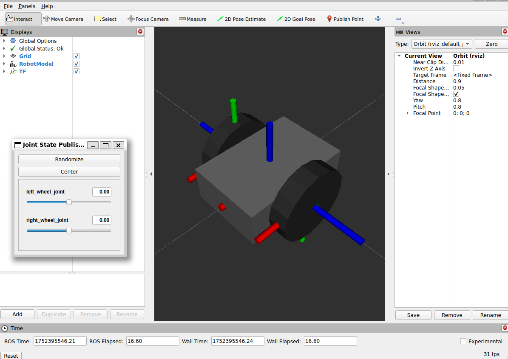
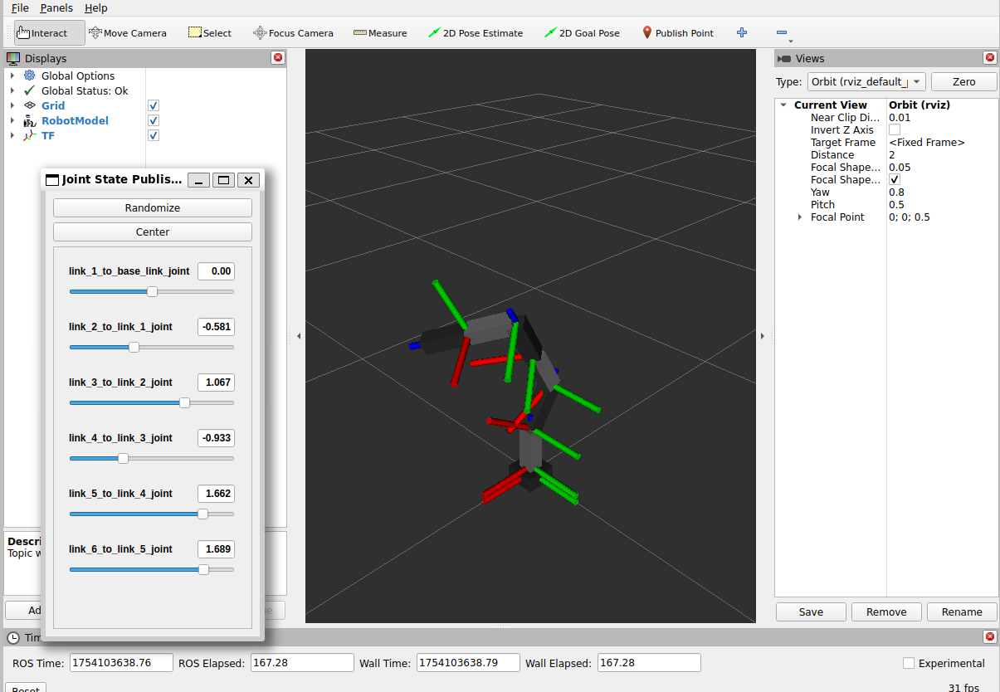

# ros2_minimal_packages
ROS 2 Minimal Packages for Tutorials.

- Wheeled Robot
    - Differential Drive Robot



- Manipulator
    - Z-Y-Y-Z-Y-Z (6DoF)



## Environments

- Ubuntu 24.04 LTS
- ROS 2 Jazzy

## Install

```sh
# Download
mkdir -p ~/ros2_ws/src
cd ~/ros2_ws/src/
git clone https://github.com/YusukeKato/ros2_minimal_packages.git

# Build
cd ~/ros2_ws
rosdep install -iry --from-paths src
colcon build --symlink-install
source ~/ros2_ws/install/setup.bash
```

## Reference

- [ROS 2 Documentation: Jazzy - Tutorials](https://docs.ros.org/en/jazzy/Tutorials.html)