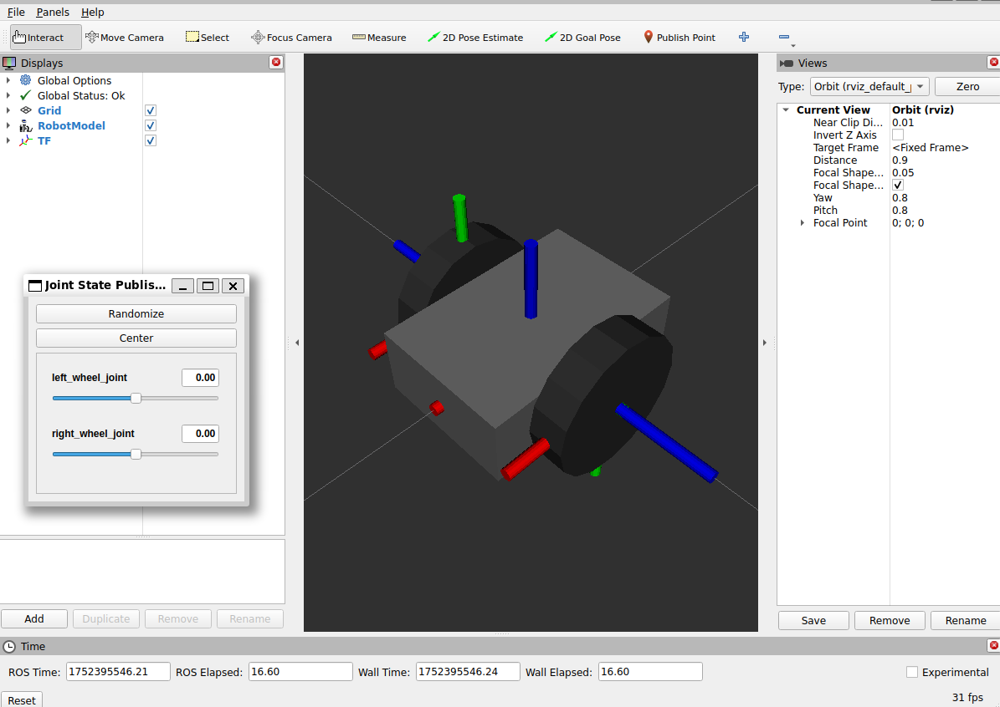
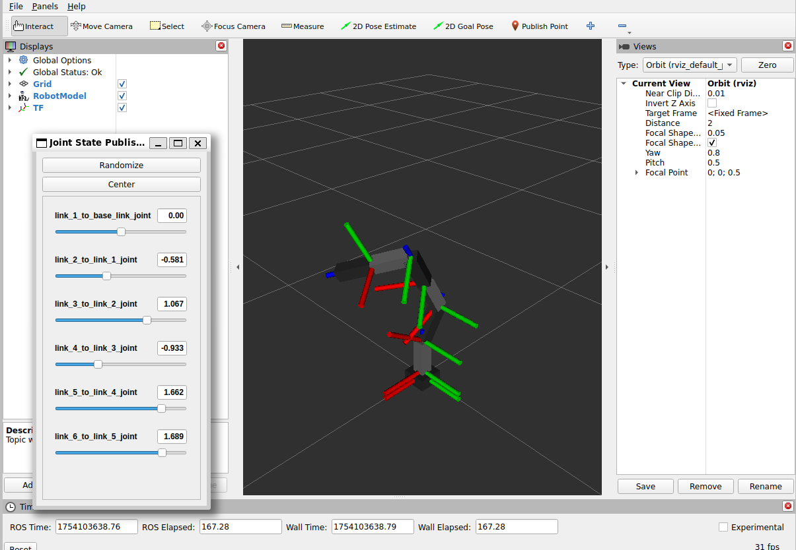

# Minimal Robot Description

## Install

[ros2_minimal_packages/README.md/#Install](../README.md#install)

## Start RViz: Wheeled Robot

```sh
$ ros2 launch minimal_robot_description minimal_wheeled_robot.launch.py
```



## Start RViz: Manipulator

Joint Rotate: Z-Y-Y-Z-Y-Z(6DoF)

```sh
$ ros2 launch minimal_robot_description minimal_manipulator.launch.py
```



## Reference

- [クワマイでもできる: xacroでロボットを書く[1] - jointとlink](https://kuwamai.hatenablog.com/entry/2019/03/31/211826)
  - Accessed 2025/07/13
- [rt-net/raspimouse_description](https://github.com/rt-net/raspimouse_description)
  - Copyright 2016-2025 RT Corporation
  - LICENSE: [MIT License](https://github.com/rt-net/raspimouse_description/blob/ros2/LICENSE)
